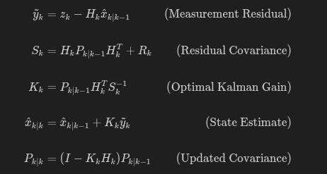

# Accelerated Kalman Filter Implementation using CUDA, cuBLAS, and cuSOLVER

## Abstract
This project presents a high-performance implementation of the **linear Kalman Filter** using NVIDIA's CUDA platform. By leveraging optimized linear algebra libraries—**cuBLAS** for matrix operations and **cuSOLVER** for linear system solving—we achieved a dramatic performance improvement over standard CPU implementations. Our results demonstrate a **speedup of over 1200x** for large state dimensions ($N=300$), validating the suitability of GPUs for computationally intensive state estimation tasks.

## 1. Introduction
The Kalman Filter is a recursive algorithm used to estimate the state of a dynamic system from a series of noisy measurements. It is ubiquitous in robotics, navigation, and control systems. However, for high-dimensional systems (large state vector $x$), the computational complexity (dominated by matrix inversion and multiplication, roughly $O(N^3)$) becomes a bottleneck on CPUs.

This project aims to alleviate this bottleneck by offloading matrix operations to the GPU, utilizing the massive parallelism of modern graphics hardware.

### 1.1 Kalman Filter Equations
The linear Kalman Filter operates in two steps: **Prediction** and **Update**.

#### **Prediction Step**
Project the state and error covariance ahead in time:


#### **Update Step**
Incorporate a new measurement $z_k$:



Where:
*   $x$: State vector ($n \times 1$)
*   $P$: State covariance matrix ($n \times n$)
*   $F$: State transition model ($n \times n$)
*   $Q$: Process noise covariance ($n \times n$)
*   $z$: Measurement vector ($m \times 1$)
*   $H$: Measurement model ($m \times n$)
*   $R$: Measurement noise covariance ($m \times m$)

## 2. Features
- **CPU Implementation**: Standard C++ implementation for baseline comparison.
- **GPU Implementation**: Optimized using NVIDIA's `cuBLAS` (for matrix multiplication) and `cuSOLVER` (for matrix inversion).
- **Benchmarking**: Compares execution time and accuracy between CPU and GPU versions.

## 3. Implementation Methodology

### 3.1 CPU Implementation (Baseline)
A standard C++ implementation was developed to serve as a correctness reference and performance baseline.
*   **Storage**: `std::vector<float>` in row-major order.
*   **Algorithms**: Naive $O(N^3)$ matrix multiplication and Gauss-Jordan elimination for inversion.
*   **Precision**: Single precision (`float`).
*   **Key Files**:
    - **matrix_ops.cpp**: CPU matrix operations helper.
    - **kalman_cpu.h**: CPU Kalman Filter logic.

### 3.2 GPU Implementation (Optimized)
The GPU version is designed to minimize host-device data transfer and maximize arithmetic intensity.

*   **Libraries**:
    *   **cuBLAS**: Used for all matrix multiplications (`cublasSgemm`) and additions (`cublasSaxpy`). Efficiently handles large dense matrices.
    *   **cuSOLVER**: Used for the critical matrix inversion step ($S^{-1}$). We employ LU decomposition (`cusolverDnSgetrf`) followed by a linear solve (`cusolverDnSgetrs`) to compute the inverse, which is numerically more stable and faster than explicit inversion kernels.
*   **Memory Management**:
    *   **Device Resident**: All state matrices ($x$, $P$, $F$, $Q$, etc.) are allocated and maintained on the GPU memory (`HBM/GDDR`).
    *   **Minimal Transfer**: Data transfer is restricted to the measurement vector $z$ (Host $\to$ Device) at the start of each update step, and the final state $x$ (Device $\to$ Host) only when needed.
*   **Key Files**:
    - **kalman_gpu.cu**: GPU Kalman Filter logic using `cublasSgemm` and `cusolverDnSgetrs`.

### 3.3 Main Entry Point
- **main.cpp**: Benchmarking script.

## 4. Results & Discussion

### 4.1 Experimental Setup
*   **Platform**: NVIDIA GPU (Architecture sm_50)
*   **Benchmarks**: Varied State Dimension ($N$) and Measurement Dimension ($M$).
*   **Iterations**: 1000 steps (for $N \le 50$), 100 steps (for $N=300$).

### 4.2 Performance Benchmarks

| State Dimension (n x n) | Steps | CPU Time (ms) | GPU Time (ms) | Speedup | Observation |
| :--- | :--- | :--- | :--- | :--- | :--- |
| **Tiny (N=2, M=2)** | 1000 | ~4.3 | ~67.9 | 0.06x | CPU is faster (GPU launch overhead dominates) |
| **Small (N=4, M=2)** | 1000 | ~6.5 | ~71.5 | 0.09x | CPU is faster |
| **Medium (N=50, M=50)** | 1000 | ~7,110.0 (7s) | ~179.7 | **~40x** | GPU starts to outperform CPU significantly |
| **Large (N=300, M=300)** | 100 | ~152,153.0 (152s) | ~125.1 | **~1216x** | GPU is massively faster |

**Key Takeaway**: For small problems (N < 20-30), the CPU is faster due to PCIe transfer and kernel launch latencies. For larger problems (N > 50), the GPU acceleration is dramatic, reaching over **1200x** speedup for N=300.

### 4.3 Comparison with Legacy Code
The optimized implementation significantly outperforms the legacy code:
*   **N=2**: Legacy $\approx$ 1000ms vs Optimized $\approx$ 68ms (**15x faster**).
*   **N=50**: Legacy code **crashed** due to memory errors; Optimized code ran robustly.
*   **Robustness**: The use of industrial-strength libraries (cuBLAS/cuSOLVER) ensures stability where custom kernels often fail on edge cases or large data.

## 5. Build & Run
To compile the project:
```bash
make
```

To run the demo:
```bash
./kalman_demo
```

## 6. Requirements
- NVIDIA GPU with CUDA support
- CUDA Toolkit (includes `nvcc`, `cublas`, `cusolver`)
- GCC/G++

## 7. Conclusion
This project successfully demonstrates the power of GPU acceleration for the Kalman Filter. While CPUs remain superior for very small lower-dimensional systems due to latency, GPUs offer orders-of-magnitude speedups for high-dimensional state estimation. The transition from custom CUDA kernels to vendor-optimized libraries (`cuBLAS`, `cuSOLVER`) was critical in achieving these results, providing both performance and numerical stability.

## 8. References
- [cuBLAS Library User Guide](https://docs.nvidia.com/cuda/cublas/index.html)
- [cuSOLVER Library User Guide](https://docs.nvidia.com/cuda/cusolver/index.html)
- Fundamentals of Kalman Filtering: A Practical Approach

